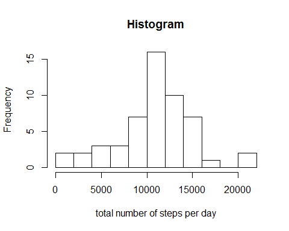
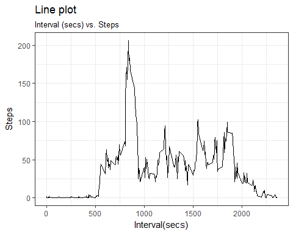
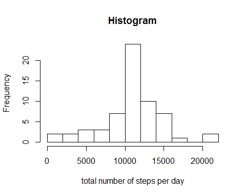
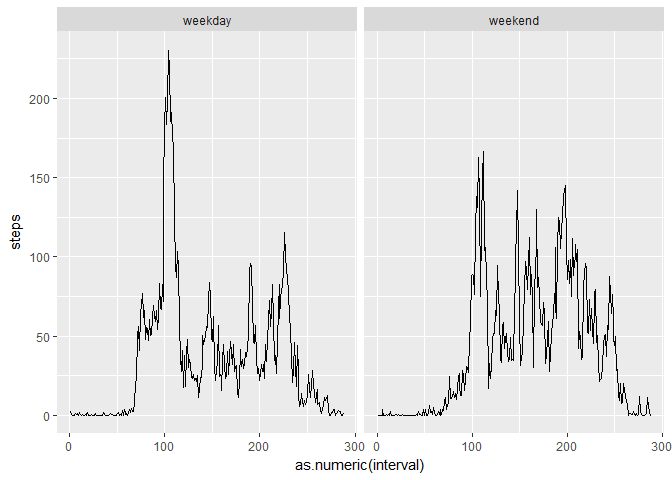

# Week 2 Assignment
Ahmed M. Kamel  

These are the answers for the assignment needed to complete week 2.

###loading and processing data 

**Steps include**:  
1- *Setting working directory*  
2- *Converting dates using `as.Date()`*


```r
setwd("c:/users/ahmed/desktop")
df<- read.csv("activity.csv", na.strings="NA", header = T)
df$date<- as.Date(df$date, format = "%Y-%m-%d")
```

###What is mean total number of steps taken per day?
1- **calculate the total number of steps taken per day**


```r
dailydata<- tapply(df$steps, df$date, sum)
print(dailydata)
```

```
## 2012-10-01 2012-10-02 2012-10-03 2012-10-04 2012-10-05 2012-10-06 
##         NA        126      11352      12116      13294      15420 
## 2012-10-07 2012-10-08 2012-10-09 2012-10-10 2012-10-11 2012-10-12 
##      11015         NA      12811       9900      10304      17382 
## 2012-10-13 2012-10-14 2012-10-15 2012-10-16 2012-10-17 2012-10-18 
##      12426      15098      10139      15084      13452      10056 
## 2012-10-19 2012-10-20 2012-10-21 2012-10-22 2012-10-23 2012-10-24 
##      11829      10395       8821      13460       8918       8355 
## 2012-10-25 2012-10-26 2012-10-27 2012-10-28 2012-10-29 2012-10-30 
##       2492       6778      10119      11458       5018       9819 
## 2012-10-31 2012-11-01 2012-11-02 2012-11-03 2012-11-04 2012-11-05 
##      15414         NA      10600      10571         NA      10439 
## 2012-11-06 2012-11-07 2012-11-08 2012-11-09 2012-11-10 2012-11-11 
##       8334      12883       3219         NA         NA      12608 
## 2012-11-12 2012-11-13 2012-11-14 2012-11-15 2012-11-16 2012-11-17 
##      10765       7336         NA         41       5441      14339 
## 2012-11-18 2012-11-19 2012-11-20 2012-11-21 2012-11-22 2012-11-23 
##      15110       8841       4472      12787      20427      21194 
## 2012-11-24 2012-11-25 2012-11-26 2012-11-27 2012-11-28 2012-11-29 
##      14478      11834      11162      13646      10183       7047 
## 2012-11-30 
##         NA
```

2- **Make a histogram of the total number of steps taken each day**

For this purpose, we need to calculate the total number of steps per day.  
A new variable called `dailydata` was computed for that purpose.

```r
hist(dailydata, 10, xlab="total number of steps per day", main = "Histogram")
```

<!-- -->


3- **Mean and median steps per day**

```r
mean(dailydata, na.rm=T)
```

```
## [1] 10766.19
```

```r
median(dailydata, na.rm=T)
```

```
## [1] 10765
```

###What is the average daily activity pattern? 
1-**Time series plot.**  

*I'll be using ggplot2 to construct this time series plot.  
*I'll calculate mean steps across intervals averaged across all days using `tapply()` after converting interval to a factor using `as.factor()`.

```r
library(ggplot2)
```

```
## Warning: package 'ggplot2' was built under R version 3.3.2
```

```r
aggdf<- aggregate(df, list(as.factor(df$interval)), mean, na.rm=TRUE)
ggplot(aes(interval, steps), data= aggdf)+geom_line()+theme_bw()+
        labs(title="Line plot",subtitle="Interval (secs) vs. Steps")+xlab("Interval(secs)")+ylab("Steps")
```

<!-- -->

2-**5-mins interval with max. steps.**  

```r
x= aggdf$interval[which.max(aggdf$steps)]
```

The interval with max. number of steps is **835**  

###Imputing missing values  
**1.Total number of missing values.**

```r
num<- sum(is.na(df$steps))
pct<- mean(is.na(df$steps))*100
```

So, the number of missing values is **2304** and this constitutes **13.1147541** % of the data

**2. Replace missing values with the mean for that interval.** 

**3.Create a new dataset that is equal to the original dataset but with the missing data filled in.**

First, we should construct an **array** to store **means** for intervals.  
Second, Conduct a for loop to replace the NAs for each interval with the **mean** for that inteval and store the data in a new data frame `new`.


```r
intmeans<- tapply(df$steps, as.factor(df$interval), mean, na.rm=TRUE)
new<- df
for(i in names(intmeans)){
        new[new$interval==i & is.na(new$steps),1]<-as.numeric(intmeans[names(intmeans)==i])
}
head(new)
```

```
##       steps       date interval
## 1 1.7169811 2012-10-01        0
## 2 0.3396226 2012-10-01        5
## 3 0.1320755 2012-10-01       10
## 4 0.1509434 2012-10-01       15
## 5 0.0754717 2012-10-01       20
## 6 2.0943396 2012-10-01       25
```
**4.Create the new histogram after the imputation and find mean and median for each day.**

```r
newdailydata<- tapply(new$steps, new$date, sum)
hist(newdailydata, 10, xlab="total number of steps per day", main = "Histogram")
```

<!-- -->

```r
mean(newdailydata)
```

```
## [1] 10766.19
```

```r
median(newdailydata)
```

```
## [1] 10766.19
```
Imputing missing data had no impact on the current data.  

##Are there differences in activity patterns between weekdays and weekends?  

Create a factor using `weekdays()`

```r
new$week<- weekdays(new$date)
new$week[new$week !="Saturday" & new$week !="Sunday"]<- "weekday"
new$week[(new$week=="Saturday" | new$week=="Sunday")]<- "weekend"
new$week<- as.factor(new$week)
```
Construct the line plot

```r
final<- aggregate(new$steps, by=list(as.factor(new$interval), new$week), mean)
names(final)<- c("interval", "day", "steps" )
ggplot(aes(y=steps, x=as.numeric(interval), group= day), data = final) +geom_line() +facet_wrap(~final$day)
```

<!-- -->
